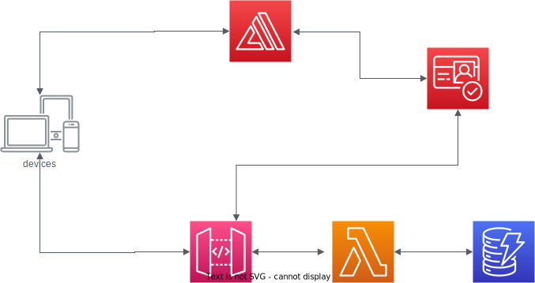

# IdeaNote

アイディアを残しておくためのアプリ 
iphoneのリマインダーを使っていたが、TODOリストなので削除前提してしまうのがもったいない気がしてアプリにしてみた 
あとDynamodbのNoSQLの設計をしてみたかった 

## 要件等
- [要件整理等](./docs/requrements_document.md)
- [DB設計](./docs/DB.md)
## アーキテクト構成図

## 開発ルール
- [PRのタイトル](./docs/development/PR_rule.md)