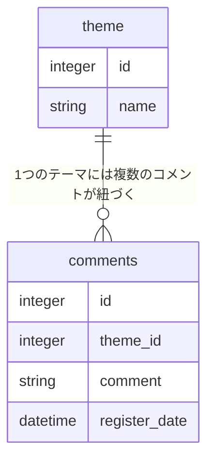

# ER図

```mermaid
erDiagram

theme ||--o{ comments : "1つのテーマには複数のコメントが紐づく"

theme {
  integer id
  string name
}

comments {
  integer id
  integer theme_id
  string comment
  datetime register_date
}

```
